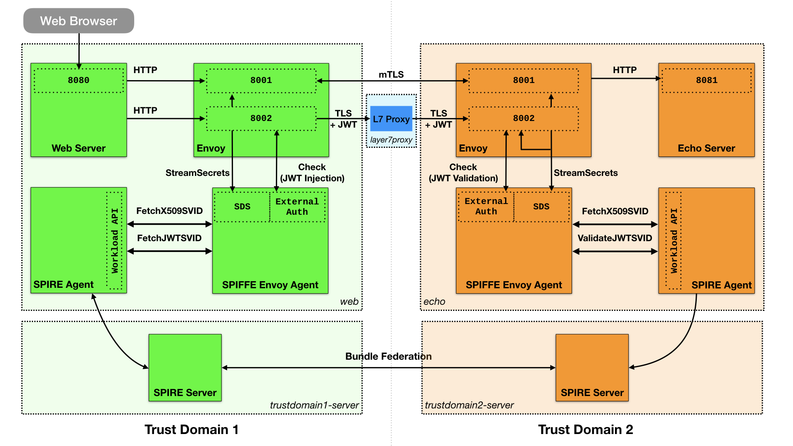
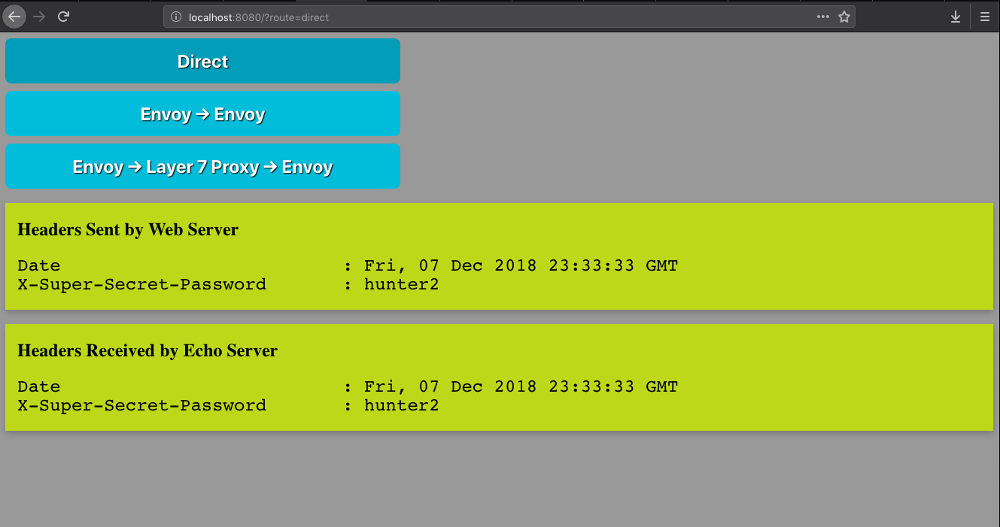
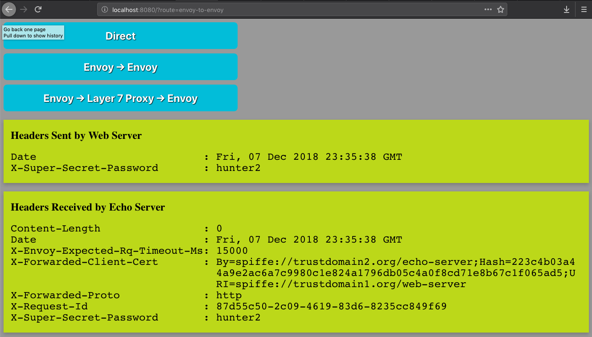
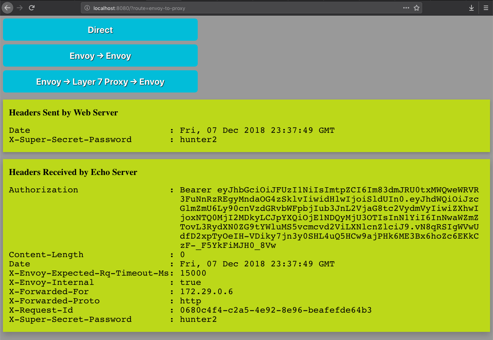

# Federation + JWT Demo using [SPIRE](https://github.com/spiffe/spire) and [Envoy](https://github.com/envoyproxy/envoy)

## Introduction

The purpose of this demo is to demonstrate trust domain federation and
[JWT-SVID](https://github.com/spiffe/spiffe/blob/master/standards/JWT-SVID.md)
support available in [SPIRE](https://github.com/spiffe/spire).

The demo shows mutually authenticated, secure communication between two
workloads: a web server and an echo server. Secure communication is established
between the workloads via a set of Envoy proxies. Envoy retrieves client and
server TLS certificates and trusted CA roots for mTLS and TLS communication
from a SPIRE Agent via a SPIFFE Envoy Agent which implements an Envoy Secret
Discovery Service ([SDS](https://www.envoyproxy.io/docs/envoy/latest/configuration/secret)). JWT injection/validation on the HTTP stream is
facilitated by an External Authorization filter also implemented by the SPIFFE
Envoy Agent.

## Architecture



The demo consists of two workloads: a Web server and an Echo server. The Web
server lives in the Trust Domain 1. The Echo server lives in Trust Domain 2.

Each workload lives in a distinct docker container. Within each container there
is also 1) an Envoy proxy, 2) a SPIRE agent, and 3) a SPIFFE Envoy Agent. The
SPIFFE Envoy Agent acts as a "bridge" to glue the SDS/ExternalAuth APIs and the
SPIFFE Workload API together.

A SPIRE server is running in each trust domain in distinct containers. These
SPIRE servers will be cross-federated during the demo by a manual transfer of
trust bundle information for each trust domain to the other.

Port 8001 on the _forward_ Envoy proxy (in the web container) is configured to
establish an mTLS connection with port 8001 on the _reverse_ Envoy proxy (in
the echo container). Client and server TLS certificates and the trusted CA
roots are obtained from the SDS service hosted by the SPIFFE Envoy Agent, which
has fetched the secrets from the SPIFFE Workload API on the SPIRE Agent.

Port 8002 on the _forward_ Envoy proxy is configured to establish a TLS
connection with a layer 7 proxy sitting in between the two trust domains. A JWT
token is injected in the HTTP request by Envoy via an External Auth filter
configured to hit the SPIFFE Envoy Agent, which contacts the SPIFFE Workload
API to obtain the JWT. The JWT is passed through the TLS connection to the
layer 7 proxy. The layer 7 proxy establishes a TLS connection with the
_reverse_ Envoy proxy on port 8002, which is configured to pass the JWT to the
External Auth service on the SPIFFE Envoy Agent for validation. The SPIFFE
Envoy Agent uses the SPIFFE Workload API to perform the validation.

## Demo

### Prerequisites

1. Linux or macOS
2. [Docker](https://docs.docker.com/)
3. [Docker Compose](https://docs.docker.com/compose/install/)
4. [Go1.11+](https://golang.org/dl/)
5. This repository:

```bash
$ git clone https://github.com/spiffe/spiffe-example.git
$ cd spiffe-example
$ git submodule update --init --recursive
$ cd spiffe-envoy-agent
```

### 1. Launch Containers and Services

#### Build containers and binaries

```
$ ./build.sh
```

#### Start containers

```
$ docker-compose up -d
Creating network "spiffe-envoy-agent" with the default driver
Creating spiffe-envoy-agent_trustdomain2-server_1 ... done
Creating spiffe-envoy-agent_trustdomain1-server_1 ... done
Creating spiffe-envoy-agent_echo_1                ... done
Creating spiffe-envoy-agent_layer7proxy_1         ... done
Creating spiffe-envoy-agent_web_1                 ... done
```

#### Start Web Server, Echo Server, and Layer 7 Proxy

```
$ ./1-start-services.sh
Starting web server...
Starting echo server...
Starting layer 7 proxy...
```

### 2. Start SPIRE Infrastructure

```
$ ./2-start-spire-services.sh
Starting trustdomain1.org SPIRE server...
Starting web server SPIRE agent...
Starting web server SPIFFE Envoy agent...
Starting trustdomain2.org SPIRE server...
Starting echo server SPIRE agent...
Starting echo server SPIFFE Envoy agent...
```

### 3. Federate Trust Domains

```
$ ./3-federate-trust-domains.sh
Federating trustdomain1.org and trustdomain2.org...
```

### 4. Configure Workload Registration Entries
```
$ ./4-create-federated-registration-entries.sh
Creating registration entry for the web server (with federation)...
Entry ID:	b8579492-a584-49e7-b931-5a85a889fce6
SPIFFE ID:	spiffe://trustdomain1.org/web-server
Parent ID:	spiffe://trustdomain1.org/spire/agent/x509pop/1c543a5e7b1a6360ed675a265802ee48e94cc512
TTL:		3600
Selector:	unix:user:spiffe-envoy-agent
FederatesWith:	spiffe://trustdomain2.org

Creating registration entry for the echo server (with federation)...
Entry ID:	b1bddb22-5e97-4f0d-9947-b13b8353bed6
SPIFFE ID:	spiffe://trustdomain2.org/echo-server
Parent ID:	spiffe://trustdomain2.org/spire/agent/x509pop/f9528ed77ac34b3cfaad55513c98d53701440336
TTL:		3600
Selector:	unix:user:spiffe-envoy-agent
FederatesWith:	spiffe://trustdomain1.org
```

### 5. Launch Browser and Explore Routes

Open a browser to `http://localhost:8080`. 

#### Direct

Press the `Direct` button to tell the Web Server to connect directly to the
Echo server.



Note that the sent and received headers match.

#### Envoy to Envoy via mTLS

Press the `Envoy → Envoy` button to tell the Web Server to connect to the Echo
server via an mTLS connection between the two Envoy proxies.



Note the `X-Forwarded-Client-Cert` header injected by _forward_ Envoy proxy and
validated by the _reverse_ Envoy proxy that shows the SPIFFE ID of the Web Server
(under `URI`) and the SPIFFE ID of the Echo Server (under `By`).

#### Envoy to Envoy via Layer 7 Proxy

Press the `Envoy → Layer 7 Proxy → Envoy` button to tell the Web Server to
connect to the Echo server via a TLS connection to a Layer 7 Proxy, passing a
JWT-SVID of the Web Server for authentication.



Note the `Authorization` header injected by the _forward_ Envoy proxy containing
the JWT-SVID.

### Things To Try

#### Unfederate Workloads

To see what happens when the workloads no longer federate with each other:

```
$ ./5-unfederate-workloads.sh
```

Run the Envoy to Envoy scenario and notice that the _forward_ Envoy proxy cannot obtain a connection to the _reverse_ Envoy proxy. This is due to the _forward_ Envoy proxy failing the mTLS handshake because it no longer trusts the server certificate presented by the _reverse_ Envoy proxy.

Run Envoy to Envoy via Layer 7 Proxy scenario and notice the JWT fails validation since the SPIRE Agent won't have keys for Trust Domain 1.

Re-federate the workloads afterwards to restore connectivity:

```
$ ./6-federate-workloads.sh
```

#### Break Authorization

The SPIFFE Envoy agent for the Echo server maintains an "allowed" list for
SPIFFE IDs that it authorizes for both x509 an JWT validation. Modifying this=
list and reloading the SPIFFE Envoy agent, influences whether or not the
_forward_ Envoy proxy is authorized to connect upstream.

Edit the "allowed" list by editing the configuration and looking for the
`allowed_spiffe_ids_x509` and `allowed_spiffe_ids_jwt` lists:

```
$ docker-compose exec echo vim /etc/spiffe-envoy-agent.conf
```

Afterwards, reload the SPIFFE Envoy Agent:

```
$ docker-compose exec echo reload-spiffe-envoy-agent
```

Run the Envoy to Envoy scenario. The mTLS handshake will fail between the
_forward_ and _reverse_ Envoy proxies.

Run the Envoy to Envoy via Layer 7 Proxy scenario. JWT validation will fail
because the subject claim is not in the allowed list.

Don't forget to restore the configuration and reload the SPIFFE Envoy Agent
when you are finished.

### Cleanup

Shut down the docker containers:

```
$ docker-compose down
```
